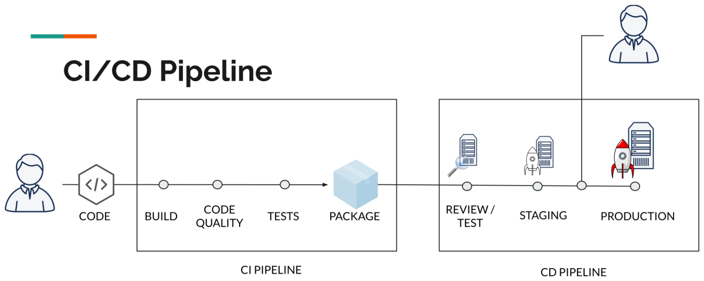

<details>
  <summary>Table of Contents</summary>
  <ol>
    <li><a href="#about-the-project">About The Project</a></li>
    <li><a href="#introduction">Introduction</a>
      <ol>
        <li><a href="#setup">Setup</a></li>
        <li><a href="#01-car-assembly-line">01-car-assembly-line</a></li>
      </ol>
    </li>
    <li><a href="#basic-cicd-workflow">Basic CI/CD workflow</a>
      <ol>
        <li><a href="#02-static-gatsby-website">02-static-gatsby-website</a></li>
        <li><a href="#ci-fundamentals">CI Fundamentals</a>
      </ol>
  </ol>
</details>

&nbsp;

## About The Project

- GitLab CI: Pipelines, CI/CD and DevOps for Beginners
- Learn GitLab CI / CD with Docker & DevOps: obtain valuable DevOps skills. Build pipelines.
- Introduction -> Basic CI/CD Workflow -> GitLab CI Fundamentals -> Advanced CI/CD workflows -> Advanced usage & specific topics
- Valentin Despa

&nbsp;

---

&nbsp;

## Introduction

- GitHub has a similar concept called **GitHub Actions**. You can create pipelines in any CI/CD systems.
- **Why GitLab CI?**
  - Scalable architecture
  - Docker first approach
  - Pipeline as a code
  - Merge requests with CI support
  - Partially open source

### Setup

- GitLab Project -> Settings -> CI/CD -> Runners
  - [Specific runners](https://docs.gitlab.com/runner/install/)
  - Shared runners (May require credit card)
- SSH Setup
- Docker Setup (Ruby Image)

### 01-car-assembly-line

- **stages**
- Job1 (Upload) & Job2 (Download) via **artifact repository**
- **GitLab Architecture**
  - Server -> Runner(s) -> Artifacts

&nbsp;

---

&nbsp;

> **Quan:** Pipelines in real projects

> **Valentin:** One pipeline per project (real project, not Gitlab project) or multiple pipeline per project?
>
> Many of the software build today is a small component (sometimes also called microservice). For such small projects, typically there is one Gitlab project and one pipeline.
>
> Gitlab can anyway only have one pipeline per Gitlab project. Larger projects may need a pipeline to span multiple projects. There is no hard rule, it depends from case to case.
>
> **One developer has his own pipeline or share a pipeline with other developers?**
>
> Typically the master pipeline is shared by everybody. If a merge request Git workflow is used, each developer will create a new branch and have his/her own pipeline. So one pipeline per branch.
>
> **When you debug by run/fail a lot of time, does this affect other developers?**
>
> If you use branches, this will not affect others. If the pipeline for the master branch fails, this will affect everyone. I hope this clarifies a few things.

&nbsp;

---

&nbsp;

## Basic CI/CD workflow

- **Continuous Integration (CI)**
  - Practice of continuously integrating code changes
  - Ensures that the project **can still be built/ compiled**
  - Ensures that any changes **pass all tests**, guidelines, and code compliance standards
  - **CI Server:** Jenkins, GitLab CI, Circle CI TeamCity, Travis, etc.
  - **Advantages:**
    - Errors are detected early in the development process
    - Reduces integration problems
    - Allows developers to work faster
- **Continuous Delivery (CD)**
  - Ensures that the software can be **deployed anytime** to production
  - Commonly, the latest version is **deployed to a testing or staging system**
- **Advantages of CI & CD**
  - **Ensures that every change is releasable** by testing that it can be deployed
  - **Reduced risk** of a new deployment
  - **Delivers value** much faster



### 02-static-gatsby-website

```sh
cd 02-static-gatsby-website && npm run develop

# Build the project locally
# requires gatsby-cli
gatsby build
```

- Build Step
- Exit status
  - **0:** Job succeeded
  - **1 - 255:** ERROR: Job failed: exit code 1
- Running jobs in parallel
  - Assigning two jobs to the same stage makes them run in parallel
  - Make sure there are no dependencies between them
- Running jobs in the background
  - Server takes a few seconds to start
  - [Failed writing body](https://stackoverflow.com/questions/16703647/why-does-curl-return-error-23-failed-writing-body)
- surge.sh for Frontend
- **Environment variables**
  - `SURGE_LOGIN`
  - `SURGE_TOKEN`

&nbsp;

---

&nbsp;

### CI Fundamentals

- [Predefined variables reference](https://docs.gitlab.com/ee/ci/variables/predefined_variables.html)
- [Scheduled pipelines](https://docs.gitlab.com/ee/ci/pipelines/schedules.html)
- Common steps needed to run a job
  - Delegate job to a Runner
  - Download & start Docker image
  - Clone the repository
  - Install any required dependencies
  - Run the actual step
  - Save the result (if needed)

&nbsp;

---

&nbsp;

> **I:** .env instead of sed
>
> Instead of sed (which is a powerful tool), you could use a .env.\* file to inject variables for production builds. This has the advantage, that instead of some custom template conventions, you would use standard node options.

```html
<div>Version: {`${process.env.GATSBY_VERSION}`}</div>
```

> and in the CI pipeline, before build you would simply do

```sh
    echo "GATSBY_VERSION=${CI_COMMIT_SHORT_SHA}" > .env.production
```

> to make use of this, you have to add the following to your gatsby-config.js

```js
require('dotenv').config({ path: `.env.${process.env.NODE_ENV}` });
```

> [source: gatsby docs | env variables](https://www.gatsbyjs.com/docs/how-to/local-development/environment-variables/#example-of-using-an-environment-variable)

&nbsp;

---

&nbsp;

> **Shubham:** Is it recommended to build the job again for the master pipeline when we already have build it for the review branch? if yes why?? if so why?

> **Valentin:** Yes, we only build and deploy to production from the main pipeline/branch. Why? Because work in branches is not integrated. We only want to deploy work that is fully integrated & tested against the main branch.
>
> You could easily run into issues when multiple developers work in the same codebase and multiple branches and merge requests are open. While such a conflict does not happen all the time when it does occur it can get ugly. So for that reason, we have already rebuilt the software in the main branch.
>
> You can see the usage merge request/branches as a way to simulate what will happen in the main branch.

&nbsp;

---

&nbsp;

- **`policy`**
  - The **default cache behavior** in GitLab CI is to **download the files at the start** of the job execution (pull), and to **re-upload them at the end** (push). This allows any changes made by the job to be persisted for future runs (known as the **pull-push cache policy**).
  - Gitlab offers the possibility of defining how a job should work with cache by **setting a policy**. So if we want to skip uploading cache file, we can use the setting in the cache configuration: `policy: pull`
  - While downloading the cache (pull) **saves us time**, we still have a few jobs that do redundant work: updating the cache after each run (push). This still does cost us time and we really do not need this behavior, as the cache remains the same. The chance of a npm dependency changing during the execution of the pipeline is very small.
- **`schedules`**

```yml
# If we want to run a job only when the pipeline is triggered by a schedule, we can configure it with:
only:
  - schedules

# If you don't want to run a job when the pipeline is triggered by a scheduled run, simply add to the respective jobs:
except:
  - schedules
```

- **Artifacts**
  - Usually the output of a build tool
  - Designed to save some compiled/ generated part of the build
  - Can be used to pass data between stages/ jobs
- **Caches**
  - Not to be used to store build results
  - Should only be used as a **temporary storage for project dependencies**
- [How cache is different from artifacts](https://docs.gitlab.com/ee/ci/caching/#cache-vs-artifacts)
- [Environments and deployments](https://docs.gitlab.com/ee/ci/environments/)
  - On GitLab website -> Project -> Deployments -> Environments
- [Shell Parameter Expansion](https://www.gnu.org/software/bash/manual/html_node/Shell-Parameter-Expansion.html)
- [Gitflow Workflow](https://www.atlassian.com/git/tutorials/comparing-workflows/gitflow-workflow)
- **Branches**
  - Avoids breaking the master
  - Ensures that CD is always possible
  - Each feature/ task/ bugfix could be done on a separate branch
  - Once the work is done, tested and reviewed, it can be **merged back to master**
  - Branching models such as **GitFlow**
  - On GitLab website -> Project -> Settings -> Merged requests -> Fast-forward merge
  - On GitLab website -> Project -> Settings -> Merged requests -> Merge checks -> Pipelines must succeed
- **Dynamic environments**
  - As each Merge Request/ branch is deployed to an environment, we can easily **review the changes made**
  - Sometimes it makes sense to **run additional tests** on a system that was deployed
  - **Changes can be reviewed by non-developers** as well (Testers, Product Owners/ Project Managers, Domain Experts and so on)
- **Destroying environments**
  - [surge teardown](https://surge.sh/help/tearing-down-a-project)
- [**before_script & after_script configuration**](https://docs.gitlab.com/ee/ci/yaml/#before_script-and-after_script)

&nbsp;

---

&nbsp;
